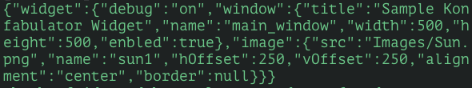
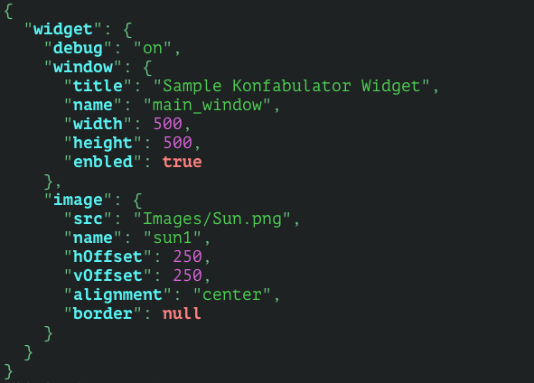

pretty-json
===========

This tiny program reads any JSON code from STDIN and output a well-formatted and colorized version.

## Screenshots

### Before:



### After:



## Installation

Tested only on OS X.

```sh
$ sudo curl -s https://raw.github.com/secreek/pretty-json/master/pj >/usr/local/bin/pj \
&& sudo chmod +x /usr/local/bin/pj
```

## Usage

```sh
$ curl <url> | pj
```
or

```sh
$ cat <file.json> | pj
```

## Try it now

An original JSON:

```sh
$ curl -s http://www.seismi.org/api/eqs?limit=20
```

Now with formatter and hilighter:

```sh
$ curl -s http://www.seismi.org/api/eqs?limit=20 | pj
```

An even complex sample:

```sh
$ curl -s https://api.github.com/events | pj
```
